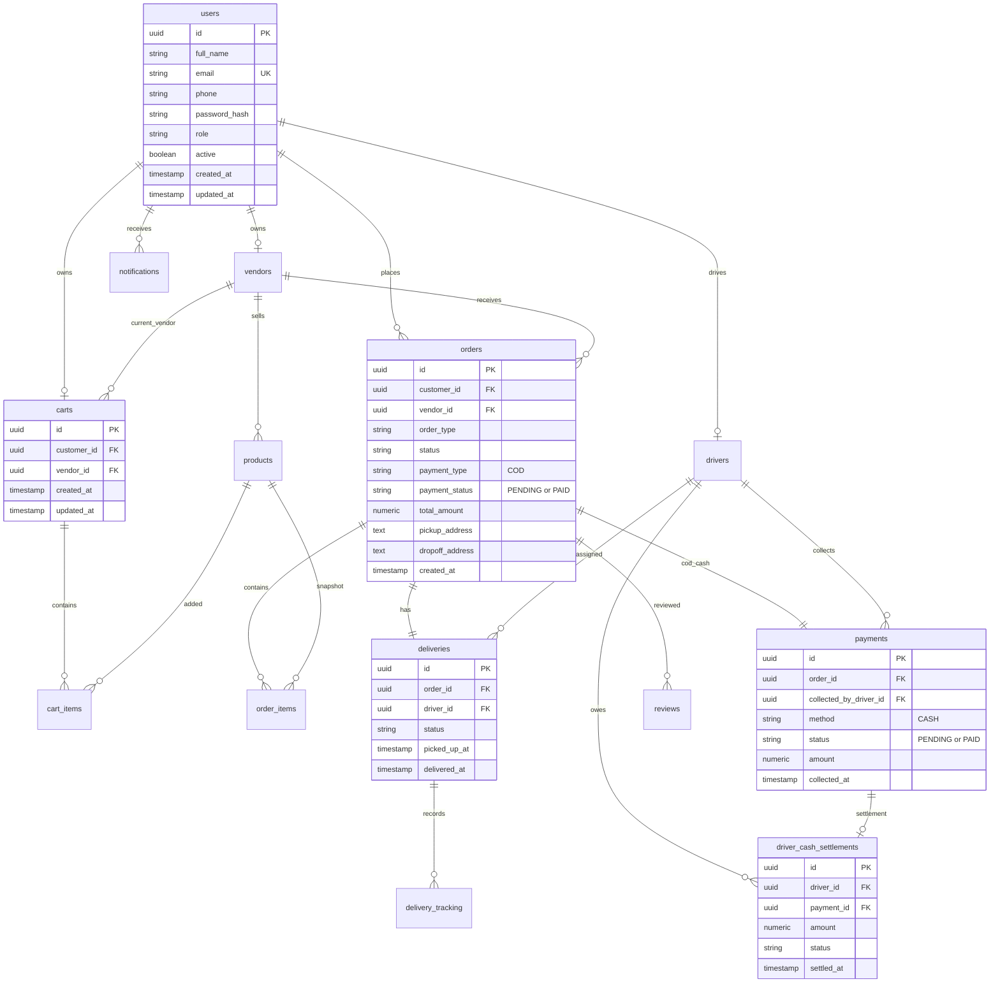

# Northuen ERD

```mermaid
erDiagram
    users ||--o| vendors : owns
    users ||--o| drivers : drives
    users ||--o{ orders : places
    vendors ||--o{ products : sells
    users ||--o| carts : owns
    vendors ||--o{ carts : current_vendor
    carts ||--o{ cart_items : contains
    products ||--o{ cart_items : added
    vendors ||--o{ orders : receives
    orders ||--o{ order_items : contains
    products ||--o{ order_items : snapshot
    orders ||--|| deliveries : has
    drivers ||--o{ deliveries : assigned
    deliveries ||--o{ delivery_tracking : records
    orders ||--|| payments : cod_cash
    drivers ||--o{ payments : collects
    drivers ||--o{ driver_cash_settlements : owes
    payments ||--o| driver_cash_settlements : settlement
    orders ||--o{ reviews : reviewed
    users ||--o{ notifications : receives

    users {
        uuid id PK
        string full_name
        string email UK
        string phone
        string password_hash
        string role
        boolean active
        timestamp created_at
        timestamp updated_at
    }

    orders {
        uuid id PK
        uuid customer_id FK
        uuid vendor_id FK
        string order_type
        string status
        string payment_type "COD"
        string payment_status "PENDING or PAID"
        numeric total_amount
        text pickup_address
        text dropoff_address
        timestamp created_at
    }

    payments {
        uuid id PK
        uuid order_id FK
        uuid collected_by_driver_id FK
        string method "CASH"
        string status "PENDING or PAID"
        numeric amount
        timestamp collected_at
    }

    carts {
        uuid id PK
        uuid customer_id FK
        uuid vendor_id FK
        timestamp created_at
        timestamp updated_at
    }

    driver_cash_settlements {
        uuid id PK
        uuid driver_id FK
        uuid payment_id FK
        numeric amount
        string status
        timestamp settled_at
    }

    deliveries {
        uuid id PK
        uuid order_id FK
        uuid driver_id FK
        string status
        timestamp picked_up_at
        timestamp delivered_at
    }
```
